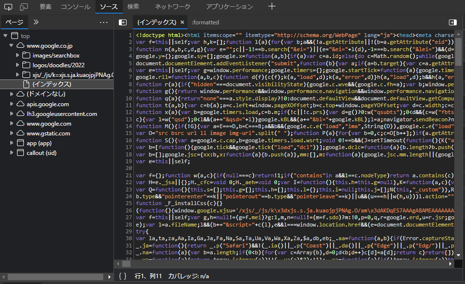
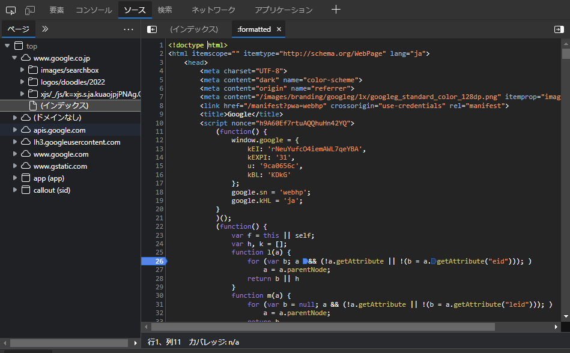

# Walking An Application

組み込みのブラウザツールの使い方について説明する
ソースの表示 　・ブラウザでWebサイトのソースコードを表示する。
インスペクター　・ページ要素を検査し、通常はブロックされているコンテンツを表示するための変更などが行える
デバッガ 　・ページのJavaScriptを検査および制御する（Edge、chromeではsources）
ネットワーク - ページが行うすべてのネットワーク要求を表示する。例　ファイルの受け渡し

## 　ページソースの表示

WEBサイトの表示中に右クリックをするとメニューに「ページソースの表示」からページソースを閲覧できる
またURLの前に「view-source:」をつけることでページソースを閲覧することができる 
例　view-source:https://www.google.com/

## inspector

ページソースの表示は常に Web ページに表示される内容を表すとは限らない。
これは、CSS、JavaScript、およびユーザー操作によってページのコンテンツとスタイルが変更される可能性があるためである。
よってページソースの表示では現時点でブラウザウィンドウに表示されているものを表示する。
これによってページ要素を編集して操作したり、デバッグを行いやすくする。

## Debugger

Debuggerの使い方としては
・縮小されたコードをきれいに出力する
・ブレイクポイントなどの設定
・コードのステップ実行
などがあげられる
「縮小されたコードをきれいに出力する」では

のように見やすい形で出力することができる

「ブレイクポイントなどの設定」ではブレイクポイントというコードの実行を一時停止する場所を設定することでコードのデバッグを行える
ブレイクポイントの設定はブレイクポイントを設定したい行をクリックをすることで行える

「コードのステップ実行」ではPlay、Step over、Step in、Step outといった機能がある
「Play」では次のブレイクポイントの位置に移動することができる
「Step over」では同じ関数の次の行に進む
「Step in」では関数内の次の行に進む。ただし、関数呼び出しの場合は、呼び出された関数に入る。
「Step out」では現在の関数の終わりまで実行。この場合、デバッガは関数からの戻り値をスキップし、呼び出し元に実行を戻す。

## Network

「Network」ではWEBページが外部に行う要求を追跡することができる
これによってやり取りされているすべてのファイルを閲覧することができる
